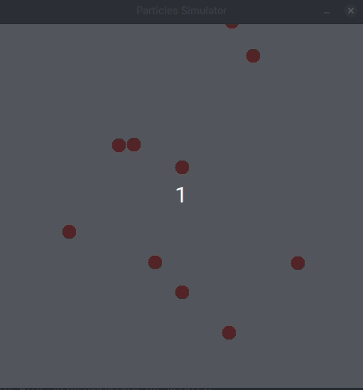

# Particles Collision Simulator

[](https://lbesson.mit-license.org/)

A system that can simulate the collision between many small particles following the law of physics about elastic collision.

<div style="text-align:center">
    
</div>

## Motivation

This project was created in order to help me learn more about the use of PriorityQueue data structure as well as Java Swing library to build GUI application.

Using event-driven programming, the system was constructed base on the events that can happen during the simulation. The order of the event will base on the time that the event occur.

In order to get the earliest (smallest) event that will happen next, we use the PriorityQueue to achieve O(logN) performance.

## Framework used

This project was built with:

- Java Swing: used to build a class dedicated to draw different shapes as well as handle animation on the canvas. 

## Installation

Everything you need is to install Java 11 (or above) to run the system.

## How to use (on Linux)

__1. Compile the source code__

To compile the code, make sure you are in the directory that contains all the source code and then simply type the following command to the terminal:

```
~$ javac *.java
```

__2. Run the class file__

After compiling the code, all you need to do is to run the generated Simulator class file. This can be done by using the following command:

```
~$ java Simulator  <number_of_particles>  <simulation_time_limit>
```

You will need to give the program 2 arguments. The __first argument__ will be __the number of particles__ involving in the simulation, depends on your hardward resource this could vary from __10 to 50 (or above)__. The __second argument__ will be __the time limit__ for the simulation, after this period of time is exceeded, the simulation will stop.

__3. Screenshot__

This is how the simulation will look like:

<div style="text-align:center">
    
</div>

## License

MIT &copy; KhoaNam225
